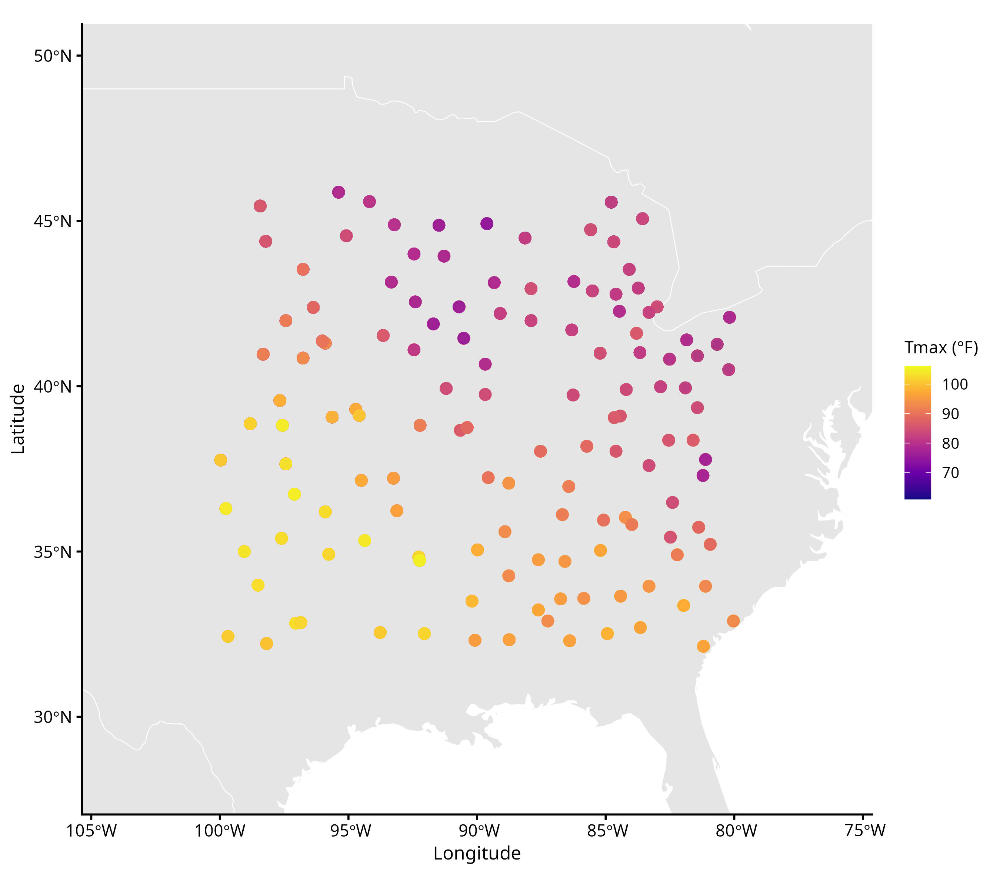
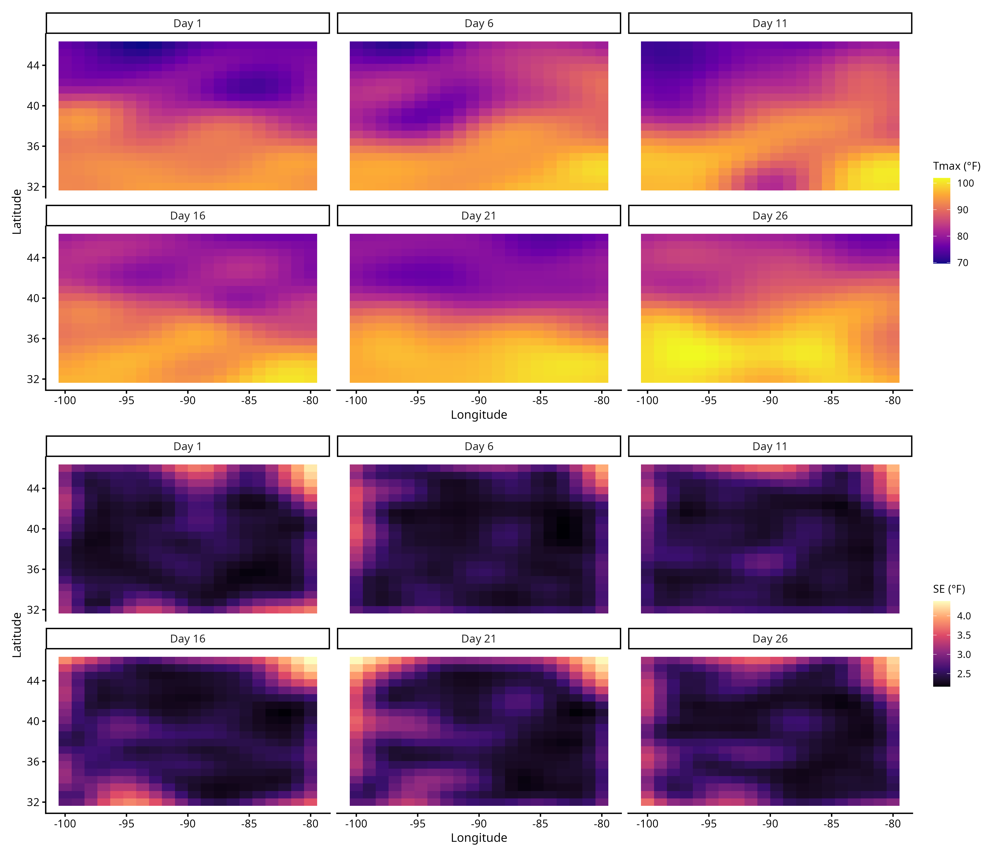

# Spatio-Temporal Kriging of NOAA Maximum Temperatures

Analysis of daily maximum temperature (Tmax) across the central and eastern United States during July 1993, using spatio-temporal geostatistical methods implemented in R.



---

## Overview

This project fits a universal kriging model to NOAA weather station data, estimating a Gaussian spatio-temporal covariance structure via maximum likelihood and producing spatial prediction surfaces with associated uncertainty quantification. It also benchmarks kriging against a purely trend-based OLS predictor using a held-out test set.

## Methods

**OLS regression** fits a linear trend surface in longitude, latitude, and day as a baseline model, capturing the large-scale spatio-temporal pattern in Tmax.

**Covariance estimation** models the OLS residuals with a Gaussian spatio-temporal covariance function:

$$C_\theta\bigl((s_i, t_i),(s_j, t_j)\bigr) = \sigma^2 \exp\!\left(-\frac{(\text{lon}_i - \text{lon}_j)^2}{a^2} - \frac{(\text{lat}_i - \text{lat}_j)^2}{b^2} - \frac{(t_i - t_j)^2}{c^2}\right) + \tau^2 \mathbf{1}_{\{i=j\}}$$

Parameters $\theta = (\sigma^2, a, b, c, \tau^2)$ are estimated by maximising the Gaussian log-likelihood, using Cholesky decomposition for numerical stability.

**Universal kriging** produces BLUP predictions and kriging variances at each point of a 20x20 spatial grid across 6 days in July 1993, accounting for both the estimated trend and the residual covariance structure.

## Results

Kriging prediction surfaces and standard errors across 6 days in July 1993:



| Model   | Test RMSE (°F) |
|---------|----------------|
| OLS     | ~5.0           |
| Kriging | ~3.5           |

> Replace placeholder RMSE values with your actual output.

Kriging recovers local spatial structure by conditioning on nearby observations, while the OLS surface is smooth and monotone, driven entirely by the latitude/longitude trend.

---

## Project Structure

```
.
├── data/
│   └── NOAA_df_1990.rda        # source data (see below)
├── documents/
│   ├── coursework_spec.pdf
│   └── project_report.pdf
├── figures/                    # generated automatically on first run
├── spatio_temporal_kriging.R   # main analysis script
└── README.md
```

## Getting Started

### Prerequisites

```r
install.packages(c(
  "tidyverse",
  "ggplot2",
  "sf",
  "rnaturalearth",
  "rnaturalearthdata",
  "patchwork"
))
```

### Data

`NOAA_df_1990.rda` is not included due to its size. It comes from the `STRbook` R package:

```r
install.packages("STRbook")
library(STRbook)
data("NOAA_df_1990")
save(NOAA_df_1990, file = "data/NOAA_df_1990.rda")
```

### Running

```bash
Rscript spatio_temporal_kriging.R
```

The `figures/` directory is created automatically on first run.

---

## Author

Mo Altrabsheh
